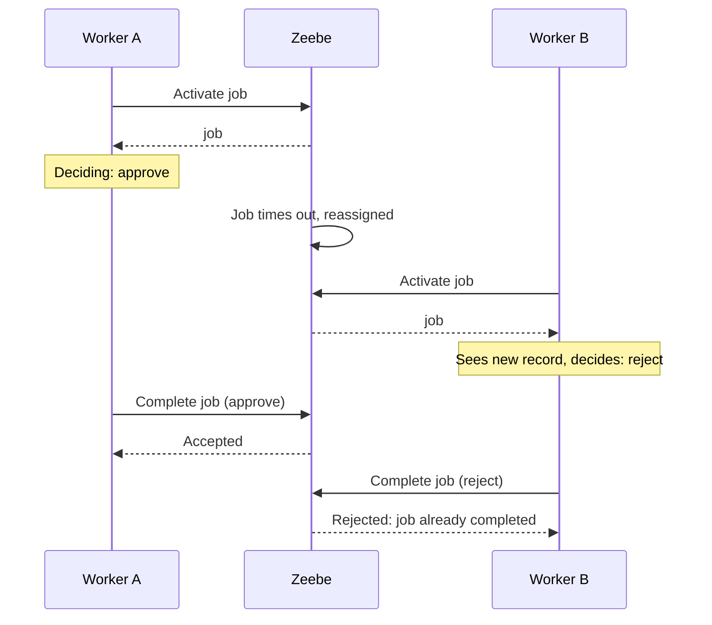
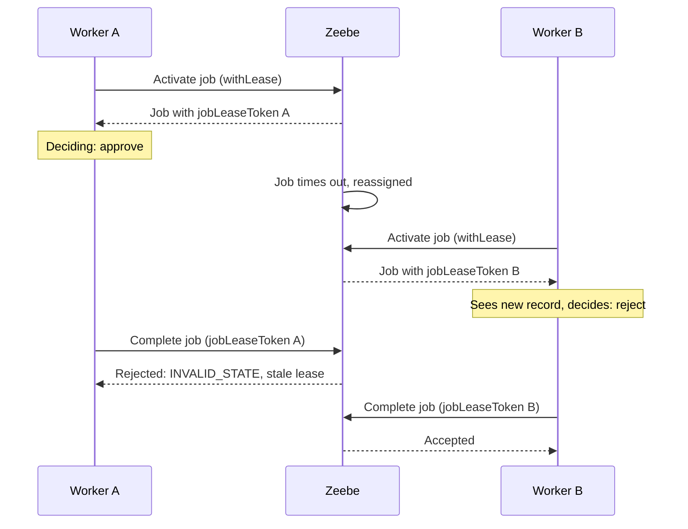
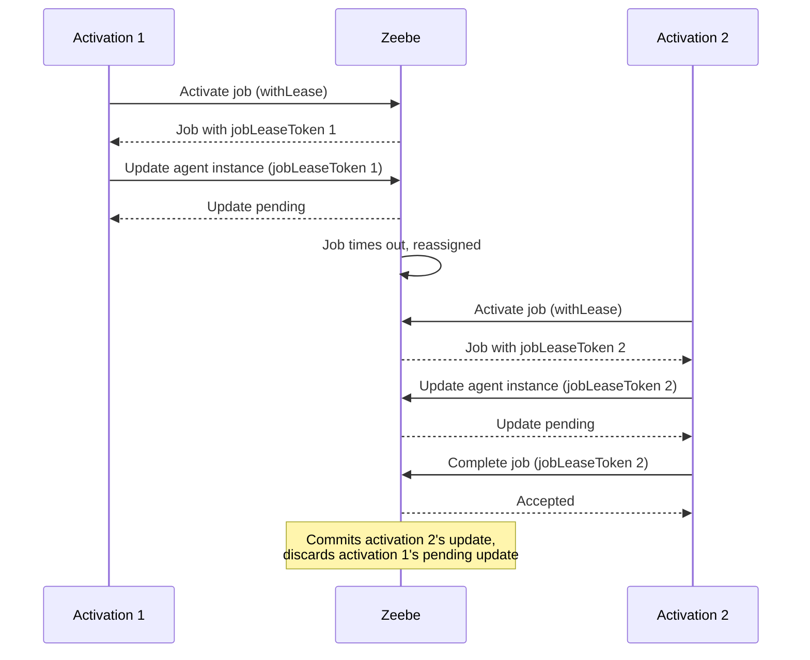

# Job workers — Job leasing

A job lease is an opt-in, opaque token that fences a specific activation of a job. It lets a worker prove its activation is still current when it interacts with Camunda.

For example, consider a job worker that performs a credit check on a loan application and completes the job with its decision: approve or reject. Worker A activates the job and is on its way to approving, but a new negative evaluation appears on the applicant before it completes, and the job's deadline passes. Zeebe reassigns the job to worker B, which sees the new evaluation and decides to reject instead. Without a lease, Zeebe only checks that the job is still activated, not which activation the completion came from, so if worker A's stale approval reaches Zeebe first, it wins: funds get disbursed on outdated information, and worker B's correct rejection is discarded.

With leasing, worker A's completion carries its own activation's token, which becomes stale the moment worker B's activation supersedes it, so Zeebe rejects it regardless of arrival order. The outcome flips: instead of whichever completion arrives first, the most up-to-date activation's completion wins.

Camunda's own [agentic orchestration](https://docs.camunda.io/docs/next/components/agentic-orchestration/agentic-orchestration-overview) builds on this same guarantee for visibility into [agent instance](https://docs.camunda.io/docs/next/components/agentic-orchestration/agent-definitions-and-instances#agent-instances)'s conversation. Before completing, an agent worker separately reports its reasoning as an [agent instance update](https://docs.camunda.io/docs/next/apis-tools/orchestration-cluster-api-rest/specifications/update-agent-instance.api), tied to its lease token. If a later activation supersedes it and completes instead, Zeebe discards the superseded activation's pending update and commits the winning one's, so a retry's contradicting reasoning never gets mixed with the activation that actually gets acted on.

See [connect an external agent](https://docs.camunda.io/docs/next/components/agentic-orchestration/connect-external-agent#step-2-activate-the-job-with-a-lease) for a concrete walkthrough of activating a job with a lease and reporting history against it.

---
Source: https://docs.camunda.io/docs/next/components/concepts/job-workers
