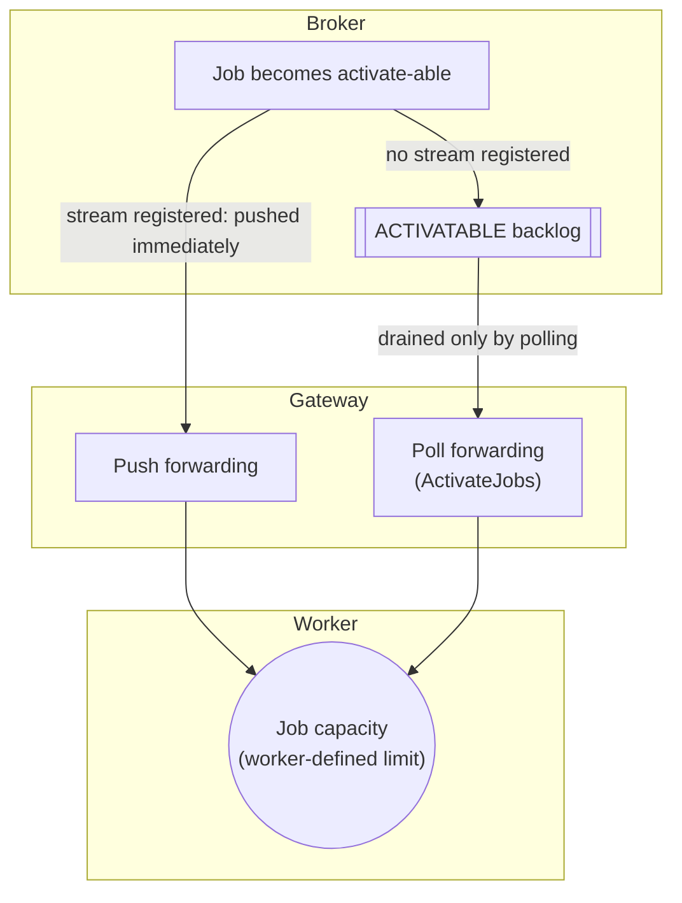

# Job workers — Job streaming — How job streaming and polling deliver jobs

Job streaming and polling are separate delivery paths, not two ways of draining the same queue.

Zeebe queues any job that has no registered stream for its type in an internal backlog (the `ACTIVATABLE` state), and long polling (via the [`ActivateJobs` RPC](https://docs.camunda.io/docs/next/apis-tools/zeebe-api/gateway-service#activatejobs-rpc)) is the only path that serves this backlog. A pushed job bypasses the backlog only on its first delivery attempt: as soon as the job becomes `ACTIVATABLE`, Zeebe pushes it directly to a registered stream for its type, if one exists. If the push fails or the job times out before completion, the job returns to the `ACTIVATABLE` backlog like any other job.

The following diagram shows both delivery paths, from the broker through the gateway to the worker’s job capacity:

---
Source: https://docs.camunda.io/docs/next/components/concepts/job-workers
