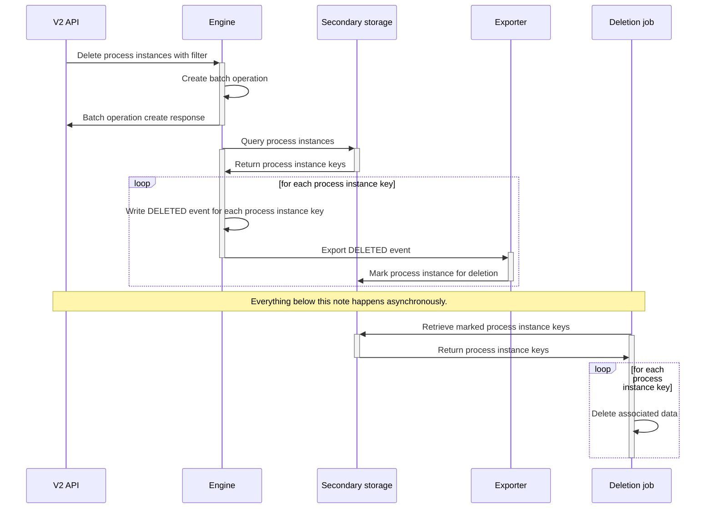

# Process instance deletion — Eventual consistency

Process instance deletion runs asynchronously. Depending on how many process instances you delete, it can take time for the data to be removed and for the process instance to disappear from Operate.

## Technical details

This section explains how process instance deletion is handled internally to help you understand timing and consistency behavior.

Deleting one or more process instances uses [batch operations](https://docs.camunda.io/docs/next/components/concepts/batch-operations).

The Zeebe engine queries [secondary storage](https://docs.camunda.io/docs/next/self-managed/concepts/secondary-storage/index) for process instances to delete. For each instance found, the engine writes a delete command to the log, which results in a deleted event.

Exporters consume the deleted event and write a record to secondary storage to mark the process instance for deletion. An asynchronous scheduled task then deletes all data associated with each marked process instance.

---
Source: https://docs.camunda.io/docs/next/components/concepts/process-instance-deletion
