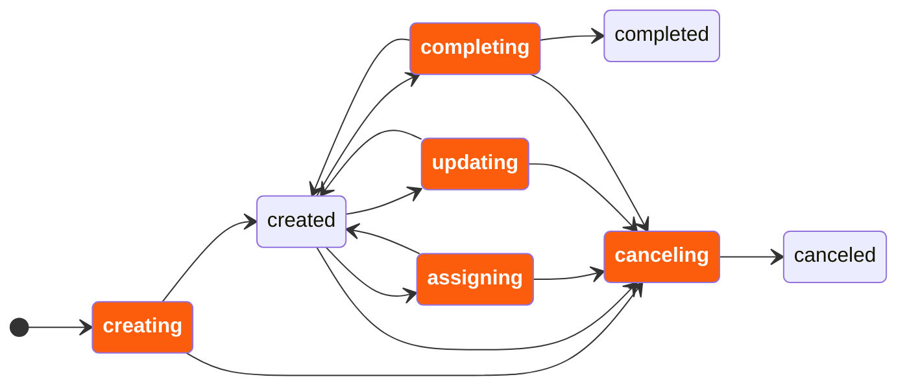

# User task listeners

User task listeners allow users to react to specific user task lifecycle events.

A [user task listener](https://docs.camunda.io/docs/next/reference/glossary#user-task-listener) allows users to react to specific user task lifecycle events.

**Tip**
Try out our [getting started with user task listeners guide](https://docs.camunda.io/docs/next/components/concepts/user-task-listeners-guide).

## About user task listeners

User task listeners provide flexibility and control over [user task](https://docs.camunda.io/docs/next/components/modeler/bpmn/user-tasks/user-tasks) behavior:

- They can react to user task lifecycle events, such as assigning and completing.
- They can access user task data, such as the assignee, to execute task-specific business logic.
- They can dynamically correct user task data during execution, allowing adjustments to key attributes such as the assignee, due date, and priority.
- They can deny state transitions, rolling back the task to its previous state, which enables validation of task lifecycle changes.

### Use cases

User task listeners are useful in the following scenarios:

- Implementing complex user task assignment or reassignment logic.
- Validating user task lifecycle changes, e.g. completing with valid variables.
- Notifying users of new task assignments with contextual information.
- Reacting to task completions with custom logic.

### User task lifecycle

A user task has the following lifecycle.
A user task listener can react to the events highlighted in orange.

### Blocking behavior

User task listeners operate in a blocking manner, meaning the user task lifecycle transition is paused until the task listener completes. This ensures that any corrections or validations defined by the task listener are fully applied before the task transition continues.

---
Source: https://docs.camunda.io/docs/next/components/concepts/user-task-listeners
